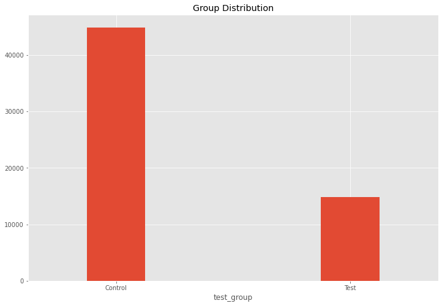
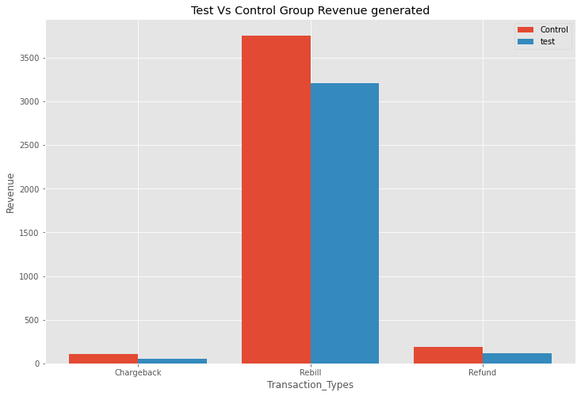

```python
# Import the packages we will use into use in this project

import pandas as pd
import numpy as np
import seaborn as sns
import matplotlib.pyplot as plt
import matplotlib.mlab as mlab
import matplotlib
plt.style.use('ggplot')
from matplotlib.pyplot import figure

%matplotlib inline
matplotlib.rcParams['figure.figsize'] = (12,8)

pd.options.mode.chained_assignment = None

# Read in the data
df = pd.read_csv(r'C:\Users\Abhis\OneDrive\Desktop\datasciencetest-master\datasciencetest-master\transData.csv')
df2 = pd.read_csv(r'C:\Users\Abhis\OneDrive\Desktop\datasciencetest-master\datasciencetest-master\testSamples.csv')
```


```python
print(df.info())
```

    <class 'pandas.core.frame.DataFrame'>
    RangeIndex: 7430 entries, 0 to 7429
    Data columns (total 4 columns):
     #   Column              Non-Null Count  Dtype  
    ---  ------              --------------  -----  
     0   transaction_id      7430 non-null   int64  
     1   sample_id           7430 non-null   int64  
     2   transaction_type    7430 non-null   object 
     3   transaction_amount  7430 non-null   float64
    dtypes: float64(1), int64(2), object(1)
    memory usage: 232.3+ KB
    None
    


```python
print(df2.info())

```

    <class 'pandas.core.frame.DataFrame'>
    RangeIndex: 59721 entries, 0 to 59720
    Data columns (total 2 columns):
     #   Column      Non-Null Count  Dtype
    ---  ------      --------------  -----
     0   sample_id   59721 non-null  int64
     1   test_group  59721 non-null  int64
    dtypes: int64(2)
    memory usage: 933.3 KB
    None
    


```python
# Data Types of the columns

print(df.dtypes)
print(df2.dtypes)
```

    transaction_id          int64
    sample_id               int64
    transaction_type       object
    transaction_amount    float64
    dtype: object
    sample_id     int64
    test_group    int64
    dtype: object
    


```python
df.drop_duplicates()
df2.drop_duplicates()
```


<div>
<style scoped>
    .dataframe tbody tr th:only-of-type {
        vertical-align: middle;
    }

    .dataframe tbody tr th {
        vertical-align: top;
    }

    .dataframe thead th {
        text-align: right;
    }
</style>
<table border="1" class="dataframe">
  <thead>
    <tr style="text-align: right;">
      <th></th>
      <th>sample_id</th>
      <th>test_group</th>
    </tr>
  </thead>
  <tbody>
    <tr>
      <th>0</th>
      <td>1</td>
      <td>0</td>
    </tr>
    <tr>
      <th>1</th>
      <td>2</td>
      <td>1</td>
    </tr>
    <tr>
      <th>2</th>
      <td>3</td>
      <td>0</td>
    </tr>
    <tr>
      <th>3</th>
      <td>4</td>
      <td>1</td>
    </tr>
    <tr>
      <th>4</th>
      <td>5</td>
      <td>1</td>
    </tr>
    <tr>
      <th>...</th>
      <td>...</td>
      <td>...</td>
    </tr>
    <tr>
      <th>59716</th>
      <td>59717</td>
      <td>0</td>
    </tr>
    <tr>
      <th>59717</th>
      <td>59718</td>
      <td>0</td>
    </tr>
    <tr>
      <th>59718</th>
      <td>59719</td>
      <td>1</td>
    </tr>
    <tr>
      <th>59719</th>
      <td>59720</td>
      <td>0</td>
    </tr>
    <tr>
      <th>59720</th>
      <td>59721</td>
      <td>0</td>
    </tr>
  </tbody>
</table>
<p>59721 rows × 2 columns</p>
</div>


```python
#Total count of members
df2.count()
```


    sample_id     59721
    test_group    59721
    dtype: int64


```python
#count of Control Group
df2[df2.test_group==0].count()
```


    sample_id     44886
    test_group    44886
    dtype: int64


```python
#count of test group
df2[df2.test_group == 1].count()
```


    sample_id     14835
    test_group    14835
    dtype: int64


```python
#Fractional Distribution in Test Group
p_test = (14835/59721)
print("Fractional Distribution of Test Group:",round(p_test,5))

#Percentage in Test Group
print("Test Group Percentage:", round(p_test* 100,2))
```

    Fractional Distribution of Test Group: 0.24841
    Test Group Percentage: 24.84
    


```python
#Fractional Distribution in Control Group
p_control = (44886/59721) 
print("Fraction Distribution of Control Group:",round(p_control,5))

#Percentage in Control Group
print("Control Group Pecentage:",round(p_control* 100,2))
```

    Fraction Distribution of Control Group: 0.75159
    Control Group Pecentage: 75.16
    


```python
# Q1: What is the aproximate probability distribution between the test group and the control group
# Answer: 

# Total number of members: 59721 (100%) 
# NUmber of members in Control Group: 44886 (~75%) (Factional Distribution 0.75)
# Number of members in Test Group: 14835 (~25%) (Factional Distribution 0.25)
```


```python
# Visual of Distribution

fig, ax = plt.subplots()
x = df2.groupby("test_group").size().plot(kind = "bar",
                                      title = "Group Distribution", 
                                      width= 0.25)
ax.set_xticklabels(["Control", "Test"], rotation="horizontal")

plt.show()

```


    

    


```python
df_merge = pd.merge(df, df2, on = "sample_id")
```


```python
#Merge based on Control and Test

df_control = df_merge[df_merge["test_group"]==0]
df_test = df_merge[df_merge["test_group"]==1]

#Total number of Trasactions under the Control Group
number_control = len(df_control)
print("Total number of trasactions in Control Group:", number_control)

#Total number of Trasactions under the Test Group
number_test = len(df_test)
print("Total number of transactions in Test Group:", number_test)

```

    Total number of trasactions in Control Group: 4050
    Total number of transactions in Test Group: 3380
    


```python
#2 Barplots merged

fig, ax = plt.subplots()

transaction_type=df_control.groupby("transaction_type").size()
dfcontrol= df_control.groupby("transaction_type").size()
dftest = df_test.groupby("transaction_type").size()
X_axis = np.arange(len(transaction_type))
plt.bar(X_axis - 0.2, dfcontrol, 0.4, label = 'Control')
plt.bar(X_axis + 0.2, dftest, 0.4, label = 'test')

plt.xticks(X_axis, transaction_type)
plt.xlabel("Transaction_Types")
plt.ylabel("Revenue")
plt.title("Test Vs Control Group Revenue generated")
plt.legend()
ax.set_xticklabels(["Chargeback", "Rebill", "Refund"], rotation="horizontal")
plt.show()
```


    

    


```python
# Rebill Ratio in Control and Test: 
#print(transaction_type)

Chargeback_control, Rebill_control, Refund_control = dfcontrol
Rebill_Control_Ratio = Rebill_control/number_control
print("Rebill_Control_Ratio:", Rebill_Control_Ratio)

Chargeback_test, Rebill_test, Refund_test = dftest

Rebill_Test_Ratio = Rebill_test/number_test
print("Rebill_Test_Ratio:",Rebill_Test_Ratio)

```

    Rebill_Control_Ratio: 0.9274074074074075
    Rebill_Test_Ratio: 0.9482248520710059
    


```python
#Q2: Is a user that must call-in to cancel more likely to generate at least 1 addition REBILL?

#A2:

print("Is a user that must call-in to cancel more likely to generate at least 1 addition REBILL? OR", Rebill_Test_Ratio,">"
      , Rebill_Control_Ratio, "?")
print(Rebill_Test_Ratio > Rebill_Control_Ratio)
 
```

    Is a user that must call-in to cancel more likely to generate at least 1 addition REBILL? OR 0.9482248520710059 > 0.9274074074074075 ?
    True
    


```python
# As the rebill ratio for the test group is greater than the rebill ratio for the control group, it is more 
# likely that the user that calls in will generate atleast 1 additional Rebill. 
```


```python
#Q3: Is a user that must call-in to cancel more likely to generate more revenues?

total_revenue = df['transaction_amount'].sum()
print("Total Revenue Generated:",round(total_revenue,5))

df_revenue_test = df_test.groupby("sample_id")
Revenue_test = df_revenue_test['transaction_amount'].sum()

mean_test = Revenue_test.mean()
print("Average revenue generated by Test Group:",round(mean_test,5))

df_revenue_control = df_control.groupby("sample_id")
Revenue_control = df_revenue_control['transaction_amount'].sum()

mean_control = Revenue_control.mean()
print("Average revenue generated by Control Group:",round(mean_control,5))

```

    Total Revenue Generated: 185272.4
    Average revenue generated by Test Group: 58.36911
    Average revenue generated by Control Group: 83.26126
    


```python
#A3: The average revenue generated by the test group is less than the average revenue generated by the control group.
# Therefore users that calls in wont most likely generate more revenues. 
```


```python
#Q4: Is a user that must call-in more likely to produce a higher chargeback rate(CHARGEBACKs/REBILLs)?

test_chargeback_rate = Chargeback_test/Rebill_test
control_chargeback_rate = Chargeback_control/Rebill_control
print("Is a user that must call-in more likely to produce a higher chargeback rate(CHARGEBACKs/REBILLs)")
print(test_chargeback_rate > control_chargeback_rate)


#A4: The rate of chargebac/k of the control group is higher than the rate of chargeback in the test group, 
# hence it is unlikely that an user who calls back will produce higer chargeback rate. 


```


```python

```
